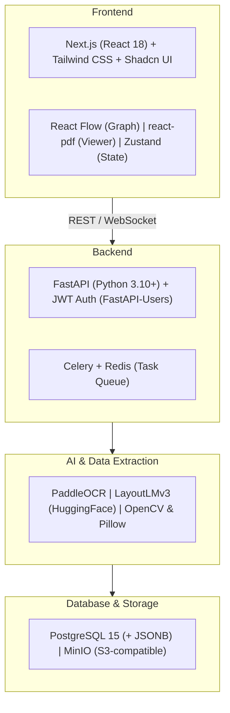

# Tech Stack

This document outlines the locked technology stack for the project. The stack is designed to balance **hackathon development velocity** with **production-grade modularity**, standardizing on **Python** for the backend (to support AI/ML dependencies) and **React** for the frontend (to enable rich, interactive visualizations).

---

## 1. Frontend (User Interface & Visualizations)

| Component | Technology | Purpose |
|---|---|---|
| **Framework** | [Next.js](https://nextjs.org/) (React 18) | Rapid routing and static serving |
| **Styling** | [Tailwind CSS](https://tailwindcss.com/) + [Shadcn UI](https://ui.shadcn.com/) | Clean, accessible, and rapid dashboard construction |
| **Graph Visualization** | [React Flow](https://reactflow.dev/) | Powers the interactive Bidder-Document Star Graph, with support for custom nodes, click events, and styling |
| **Document Viewer** | [react-pdf](https://github.com/wojtekmaj/react-pdf) + HTML5 Canvas / absolute-positioned DOM | Renders PDFs and draws bounding box overlays |
| **State Management** | [Zustand](https://github.com/pmndrs/zustand) | Lightweight state management for cross-document mismatch tracking and UI state |

---

## 2. Backend (API & Business Logic)

| Component | Technology | Purpose |
|---|---|---|
| **Framework** | [FastAPI](https://fastapi.tiangolo.com/) (Python 3.10+) | High-performance, native async support, seamless integration with Python-based ML libraries |
| **Task Queue** | [Celery](https://docs.celeryq.dev/) + [Redis](https://redis.io/) | Offloads heavy OCR and LayoutLM inference tasks from the main thread |
| **Authentication** | JWT (JSON Web Tokens) via [FastAPI-Users](https://fastapi-users.github.io/fastapi-users/) | Secure, token-based authentication |

---

## 3. AI & Data Extraction (The Intelligence Layer)

| Component | Technology | Purpose |
|---|---|---|
| **OCR Engine** | [PaddleOCR](https://github.com/PaddlePaddle/PaddleOCR) | High out-of-the-box accuracy for tabular data and mixed-language text |
| **Document Understanding** | [LayoutLMv3](https://huggingface.co/docs/transformers/model_doc/layoutlmv3) (via HuggingFace Transformers) | Classifies document types and extracts context-aware fields (e.g., distinguishing a "Turnover" label from its value) |
| **Image Processing** | [OpenCV](https://opencv.org/) & [Pillow](https://python-pillow.org/) | Deskewing, scaling, and contrast adjustment prior to OCR |

---

## 4. Database & Storage

| Component | Technology | Purpose |
|---|---|---|
| **Primary Database** | [PostgreSQL 15](https://www.postgresql.org/) | Relational storage for Tenders, Bidders, and Rules |
| **Document Store / JSON** | PostgreSQL `JSONB` columns | Flexible, schema-less storage for extracted bounding-box coordinates and OCR payloads |
| **Object Storage** | [MinIO](https://min.io/) | S3-compatible local storage for raw PDFs, split pages, and processed images |

---

## 5. Infrastructure & DevOps

| Component | Technology | Purpose |
|---|---|---|
| **Containerization** | [Docker](https://www.docker.com/) & Docker Compose | A single `docker-compose.yml` spins up the Next.js frontend, FastAPI backend, Celery worker, Redis, Postgres, and MinIO — ensuring consistent environments |

---

## Summary Diagram

All services orchestrated via Docker Compose